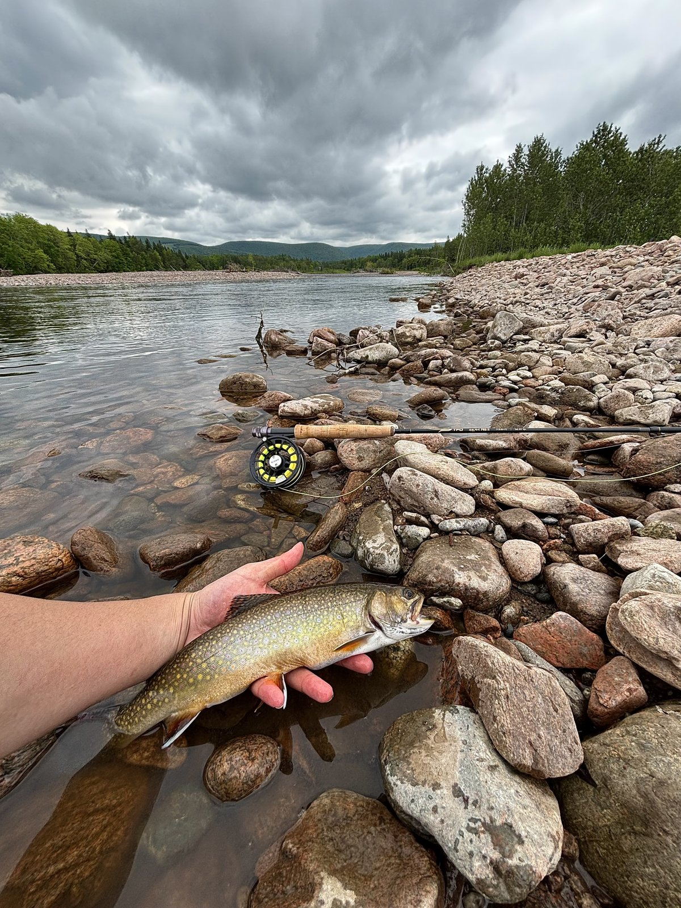

# Riverwise

Riverwise is a mobile-friendly Nova Scotia river-conditions dashboard. The MVP combines measured Water Survey of Canada discharge with nearby Open-Meteo model weather and a transparent experimental conditions score.

The score is not a prediction of catches, river safety, fish abundance, habitat quality, or legal fishing eligibility.

[View the live dashboard](https://web-production-4762c.up.railway.app) · [Check API health](https://api-production-f376.up.railway.app/health)

The [current project roadmap](docs/ROADMAP.md) sequences the remaining reliability evidence, data-quality work, better station discovery, and a forecast-first Trip Planner. [`PROJECT_SPEC.md`](PROJECT_SPEC.md) remains the source of product and data-interpretation rules.

## Why I built Riverwise

I am an avid fly angler, and the Margaree River is one of my favourite places to fish, but it is about a 3.5 drive from my house. Deciding whether to make that trip often meant piecing together river flow and nearby weather from several hard to find sources. Riverwise grew from wanting one mobile-friendly view of the available conditions while keeping the source, age, and uncertainty of the data visible. It provides context for planning a trip without pretending to predict whether the fish will bite.



*Fly fishing on the Margaree River—the trip that inspired Riverwise.*

## Current status

The deployed data product runs across six verified Water Survey of Canada gauges:

- `01FB001` — **NORTHEAST MARGAREE RIVER AT MARGAREE VALLEY**
- `01FB003` — **SOUTHWEST MARGAREE RIVER NEAR UPPER MARGAREE**
- `01FC002` — **CHETICAMP RIVER ABOVE ROBERT BROOK**
- `01EO001` — **ST. MARYS RIVER AT STILLWATER**
- `01EF001` — **LAHAVE RIVER AT WEST NORTHFIELD**
- `01ED005` — **MERSEY RIVER BELOW GEORGE LAKE**

On 2026-09-23, all six official recent-data feeds returned current parameter 47 discharge and completed a live ingestion run successfully. The three province-wide additions also returned 3,388–3,478 daily observations in the bounded ten-year backfill.

The first hosted ingestion completed successfully on 2026-09-24. Thirty-minute cloud scheduling is enabled. As of 2026-09-29, the public API reports recent discharge and ongoing score snapshots for all six gauges. The user has observed ingestion continuing while their computer was off; dated before/after evidence and the full seven-day reliability window are still being documented in [ADR 0005](docs/decisions/0005-railway-deployment.md).

Implemented:

- Versioned PostgreSQL schema and Alembic migration.
- Six verified editable station seeds spanning Cape Breton, eastern mainland Nova Scotia, and the South Shore.
- Typed WSC CSV and Open-Meteo parsing.
- Measured WSC water-temperature ingestion where a gauge reports parameter 5.
- A bounded WSC daily-flow backfill for season-matched station baselines.
- Idempotent observation updates, including revised upstream values.
- Offline fixture import and live provider import with bounded timeout/retries and independent failure recording.
- Pure versioned scoring with explicit evaluation time.
- `v1.1.0-shadow` and provisional `v1.2.0-shadow` comparisons in the Score Lab; `v1.0.0` remains the dashboard score.
- Idempotent scheduled snapshots for all three score versions, including partial, stale, and unavailable states. New snapshots persist their direct scoring inputs and point-level explanations.
- Seven- and 30-day score-history charts on each station page.
- Measured reliability reporting for provider success, data freshness, temperature coverage, observation counts, historical depth, and changed provider values.
- Station list, detail, 48-hour history, and ingestion-status API endpoints.
- Responsive station list/detail interface with visible data gaps and provenance.
- Recurring ingestion with source- and station-level run monitoring.
- Accessible station map supplemented by an equivalent text station list.
- Automated backend boundary/integration tests, frontend lint/type/build checks, and CI.
- Playwright browser journeys for station loading, detail navigation, charts, status reporting, the map's text alternative, and API error states.

Phase 2 data-quality work was deployed on 2026-10-02: [ADR 0007](docs/decisions/0007-data-quality-and-operator-alerts.md) describes source-content validation, prospective WSC revision details, station gap and failure diagnoses, stable run IDs, and deduplicated operator-alert detection. External API and ingestion-health monitors are configured, but a post-deployment observation window and confirmed email delivery are still needed before calling operator alerting reliable.

## Architecture

```text
WSC CSV ─────────┐
                 ├─> Python ingestion ─> PostgreSQL ─> FastAPI ─> Next.js
Open-Meteo JSON ─┘          │                 │
                            └─ ingest runs    └─ versioned score inputs
```

Web requests read only from PostgreSQL. They never call external providers.

## Quick start with Docker

Requirements: Docker Desktop with Compose.

```bash
cp .env.example .env
docker compose up --build -d db api web scheduler
```

Open [http://localhost:3000](http://localhost:3000). The rule comparison is at [http://localhost:3000/score-lab](http://localhost:3000/score-lab), reliability and ingestion status are at [http://localhost:3000/status](http://localhost:3000/status), and API documentation is at [http://localhost:8000/docs](http://localhost:8000/docs).

The scheduler performs a live import when it starts and then at 10 minutes past each hour. Real-time hydrometric and weather data are refreshed each cycle. Daily discharge history is imported once and refreshed at most every 20 hours. It needs internet access, and scheduling pauses when Docker Desktop or the computer is stopped or asleep. No provider API keys or accounts are required.

To run an additional live import manually:

```bash
docker compose --profile tools run --rm ingest python /workspace/jobs/ingest/ingest.py --source live
```

Provider failures are recorded independently, so one failure does not erase previously stored observations from another source or station. To load deterministic fixtures instead of live data:

```bash
docker compose --profile tools run --rm ingest
```

The fixtures preserve their source timestamps and will correctly appear stale after their 2026-09-23 observation window.

## Local development

### API and ingestion

```bash
python3 -m venv .venv
.venv/bin/pip install -r apps/api/requirements.txt
cd apps/api
../../.venv/bin/alembic upgrade head
cd ../..
.venv/bin/python jobs/ingest/ingest.py --source fixtures --evaluation-time 2026-09-23T16:30:00Z
cd apps/api
../../.venv/bin/uvicorn app.main:app --reload
```

The default local database is SQLite for a lightweight development loop. Docker and CI exercise PostgreSQL, which is the intended application database.

### Web

```bash
npm install
npm run dev:web
```

The web app expects the API at `http://localhost:8000` unless `NEXT_PUBLIC_API_URL` is set.

## Verification

```bash
cd apps/api
../../.venv/bin/ruff check . ../../jobs/ingest
../../.venv/bin/pytest -q
cd ../..
npm run verify
npx playwright install chromium
npm run test:e2e
docker compose config --quiet
```

To check local configuration, fixture parsing, database connectivity, and station count after migration/import:

```bash
.venv/bin/python jobs/ingest/diagnose.py
```

## API

- `GET /health`
- `GET /api/v1/stations`
- `GET /api/v1/ingestion`
- `GET /api/v1/operational-health` (`503` when current ingestion or discharge needs attention; not a process-uptime check). `HEAD` returns the same status without a body for external monitors.
- `GET /api/v1/reliability?days=30` (`days` must be `7` or `30`)
- `GET /api/v1/scores/compare`
- `GET /api/v1/stations/{id}`
- `GET /api/v1/stations/{id}/score-history?days=7` (`days` must be `7` or `30`)
- `GET /api/v1/stations/{id}/history?hours=48` (`1–168`; invalid values return FastAPI’s documented `422` validation response)

Known stations without usable data return `200` with explicit null/status fields. Unknown stations return `404`.

The ingestion response includes current operator findings, latest source-run IDs and error categories, and station-level discharge diagnoses. The reliability response includes descriptive observed cadence and long-gap counts. `OPERATOR_ALERT_WEBHOOK_URL` is optional and must point to a destination accepting Riverwise JSON POSTs; leave it unset until the operator chooses and tests a channel. The webhook is separate from any future user-facing fishing-condition alerts. Even with a webhook, an external monitor is required to detect a completely stopped scheduler in real time.

## Source discoveries

Water Survey of Canada’s official real-time CSV endpoint uses:

- `ID`
- `Date` in UTC ISO-8601 form
- `Parameter/Paramètre` (`47` for unit-value discharge and `5` for water temperature where available)
- `Value/Valeur`
- qualifier, symbol, approval, grade, and additional-qualifier columns

The WSC daily endpoint supplies one discharge value per date and retains provider symbols such as estimated-value markers. Riverwise imports up to ten years for a season-matched baseline, then refreshes a 14-day overlap so revisions can be updated. WSC notes that outputs other than flow and level do not have standardized quality assurance, so measured water temperature is shown with its timestamp and availability rather than treated as universally comparable.

The primary committed WSC fixture is downsampled from the official five-minute response to keep it small; values and timestamps were not rewritten. Additional small fixtures pin verified rows for the added gauges, measured temperature, and daily history. The Open-Meteo fixture is a bounded portion of the model response for the original gauge coordinates. See [`tests/fixtures/README.md`](tests/fixtures/README.md) for provenance and limitations.

Official sources:

- [Water Survey of Canada web services](https://wateroffice.ec.gc.ca/services/)
- [Station 01FB001](https://wateroffice.ec.gc.ca/report/real_time_e.html?stn=01FB001)
- [Station 01FB003](https://wateroffice.ec.gc.ca/report/real_time_e.html?stn=01FB003)
- [Station 01FC002](https://wateroffice.ec.gc.ca/report/real_time_e.html?stn=01FC002)
- [Station 01EO001](https://wateroffice.ec.gc.ca/report/real_time_e.html?stn=01EO001)
- [Station 01EF001](https://wateroffice.ec.gc.ca/report/real_time_e.html?stn=01EF001)
- [Station 01ED005](https://wateroffice.ec.gc.ca/report/real_time_e.html?stn=01ED005)
- [Open-Meteo forecast API](https://open-meteo.com/en/docs)

## Scoring

Rules live in `apps/api/app/scoring.py`. The production dashboard still uses `v1.0.0`: recent flow relative to a 14-day median, six-hour change, nearby modeled precipitation, and nearby modeled cloud cover.

The Score Lab also runs `v1.1.0-shadow`. It replaces recent flow with a percentile against prior years within ±7 calendar days, scores absolute six-hour stability, and uses measured water temperature when available. A seasonal baseline requires at least 21 daily values across at least three previous years. Missing water temperature produces a visibly partial score rather than substituting nearby air temperature. This candidate is an inspectable hypothesis, not evidence of better catch prediction.

The `v1.2.0-shadow` experiment adds a station-month flow percentile, 1- and 6-hour trends, complete 6/24/72-hour modeled precipitation windows, and a station-specific rapid-rise penalty. It shows 24-hour flow change, approximate sunrise/sunset, and nearby modeled pressure trend as unscored context. [ADR 0006](docs/decisions/0006-v1-2-shadow-conditions-model.md) records every provisional band, data-coverage rule, a measured three-version replay, the verified production rollout, and the limits of that comparison. The user has no trip outcomes this season; **none of these versions has demonstrated greater fishing accuracy**.

For a read-only comparison against a separate local PostgreSQL restore, set `DATABASE_URL` to that **local** database and run `.venv/bin/python scripts/analyze_score_models.py --max-times 36`. The script refuses a non-local database host and prints JSON with availability and score differences; it does not evaluate catch outcomes.

See the architecture decisions in [`docs/decisions`](docs/decisions) and the full [`PROJECT_SPEC.md`](PROJECT_SPEC.md).

## Deployment

Riverwise is deployed on Railway as four services:

- A private PostgreSQL database.
- A public FastAPI service with migrations and a health check.
- A public Next.js web application.
- A one-shot ingestion service scheduled every 30 minutes in UTC.

The live application is available at [web-production-4762c.up.railway.app](https://web-production-4762c.up.railway.app). The API and hosted ingestion use Docker builds, while Railway currently reports a Railpack build for the web service; see ADR 0005 for this deployment deviation. The hosted ingestion command exits after each run rather than keeping a scheduler container active.

The Postgres Backups tab requires Railway Pro for native backups on the current Trial plan, as confirmed by the user on 2026-09-29. A [manual PostgreSQL export and local restore drill](docs/deployment/postgres-backups.md) succeeded that day. The owner is deferring an off-laptop copy while there is no user data and accepts the risk of losing accumulated score and reliability history if the laptop is lost. Revisit separate encrypted storage before retaining user data.

Follow the [`Railway deployment runbook`](docs/deployment/railway.md) for configuration, cost controls, computer-off verification, and rollback. ADR 0005 records the hosting decision and remaining production evidence.

## Data and safety notes

- Hydrometric readings may be provisional, late, or revised.
- A gauge represents its location, not an entire river or access point.
- Nearby modeled air temperature is not water temperature.
- Missing values and gaps are preserved rather than interpolated for scoring.
- Provider revision counters record source-field changes detected after this feature was enabled; they are not reconstructed retroactively.
- Consult official regulations and local safety information before fishing.
